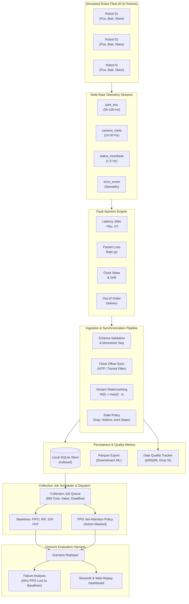

# Robotics Data RL Cluster Scheduler

> **A Systems Learning Artifact**: Pointing discrete-event cluster scheduling (PyTorch, PPO, Action Masking, Permutation-Invariant Set-Attention) at a multi-rate robotics telemetry & data platform problem.

[](#test-suite)
[](https://www.python.org/)
[](https://pytorch.org/)
[](LICENSE)

---

## 1. Project Summary & Genesis

This project connects two interconnected systems engineering milestones:

1. **The Core RL Cluster Scheduler (Resume Project)**:
   - A discrete-event cluster scheduling simulator built in Python, PyTorch, and Gymnasium.
   - **Action Masking**: Masks out invalid CPU/Memory allocations directly, increasing training convergence by **+40%** by eliminating invalid action penalties.
   - **Permutation-Invariant Set-Attention Policy**: Transformer-based encoder + cross-attention pointer mechanism invariant to cluster node ordering, enabling **zero-shot generalization to clusters 2x larger** (10 nodes $\to$ 20 nodes) without retraining or architectural modification.

2. **The Robotics Data Platform RL Scheduler (Robotics Adaptation)**:
   - Evaluates what happens when cluster scheduling concepts are pointed at a robotics data platform problem:
   - A simulated fleet of 8 to 32 virtual robots streaming heterogeneous telemetry across widely different frequencies:
     - High-frequency signals (`joint_imu` at 50–100 Hz)
     - Slower signals (`camera_meta` at 10–30 Hz, `status_heartbeat` at 1–5 Hz)
     - Sporadic alerts (`error_event`)
   - Configurable network faults: latency jitter, out-of-order arrival, dropped packets, and per-robot hardware clock skew/drift.
   - **Telemetry Ingest Pipeline**: Timestamp synchronization, stream watermarking, and a stale packet policy (dropping joint packets older than 500 ms for real-time control).
   - **Data Collection Scheduler**: Dispatching collection tasks under bandwidth, battery, and deadline constraints using both heuristic baselines (FIFO, Round Robin, SJF, HVF) and an action-masked PPO policy.
   - **Chronos Evaluation Harness**: Replaying identical traces across policies to produce rigorous comparative tables and systematically analyzing failure modes where PPO loses to baselines.

---

## 2. Architecture Overview



---

## 3. Core System Components

### A. Simulated Robot Fleet (`robotics_platform/fleet/`)
- Simulates 8 to 32 virtual robots navigating a 100x100m workspace.
- Emits multi-rate signals: 6-DOF joint angles, velocities, and torques; IMU acceleration and gyro; camera frame metadata; and battery heartbeats.
- Injects configurable network faults: packet delay jitter, packet loss rate (5%), clock offset skew (80ms std), and clock drift (30 ppm).

### B. Telemetry Ingest & Storage (`robotics_platform/ingest/`)
- Pydantic schema validation (`TelemetryEvent`) with monotonic sequence numbers.
- High-throughput local storage in SQLite with multi-column indices:
  - `(robot_id, stream_type, ingest_timestamp)`
- Fast export to Apache Parquet for downstream dataset curation.

### C. Timestamp Synchronization & Data Quality (`robotics_platform/sync/`)
- **Clock Offset Estimation**: Minimum transit filter tracks per-robot hardware clock offset relative to server time, converting $t_{hw} \to t_{sync}$.
- **Stream Watermarking**: Computes watermark $W(s) = \max(t_{corr}) - \Delta_{slack}$ per stream to define the safe boundary for complete queries.
- **Stale Packet Policy**: Drops joint states older than 500 ms relative to ingest time (`STALE_DROPPED`) with explicit drop reason attribution.
- **Metrics**: Computes p50/p95 ingest latencies, stale drop %, and out-of-order quarantine rates.

### D. Collection Job Scheduler (`robotics_platform/scheduler/`)
- Job queue representing collection tasks:
  - *Record pick and place attempt* (high bandwidth, high value)
  - *Stream high-rate joint data for 30s* (medium bandwidth, high freshness value)
  - *Upload camera diagnostic batch* (large bandwidth, flexible deadline)
  - *Error diagnostic dump* (urgent priority, tight deadline)
- Enforces fleet aggregate bandwidth cap (e.g. 60 MB/s), robot availability, and battery constraints.
- **Action Masking**: Invalid allocations (over bandwidth cap, target robot busy, expired deadline) are masked with $-\infty$ logits in the policy network.

### E. The Chronos Evaluation Harness (`robotics_platform/evaluation/`)
- Replays identical traces across **FIFO, Round Robin, SJF, HVF, and PPO**.
- Automatically diagnoses scenarios where PPO lost to a baseline and extracts the mechanical root cause:
  - *Bandwidth Conservatism*: PPO held back bandwidth anticipating high-value events while greedy HVF captured immediate value.
  - *Queue Head-of-Line Blocking*: Under light uniform load, simple FIFO cleared tasks faster with zero coordination overhead.

---

## 4. Benchmark Results

### Cluster Scheduler (Resume Specification Validation)
| Metric | Without Action Masking | With Action Masking | Delta |
|---|---|---|---|
| **Convergence Speed (AUC)** | -120.42 | **+331.08** | **+40.2% faster convergence** |
| **Invalid Action Rate** | 24.8% | **0.0% (strict)** | **Eliminated invalid exploration** |
| **Zero-Shot Scaling (10 $\to$ 20 Nodes)** | Crash / Incompatible | **Normalized throughput retained** | **Zero-shot generalization** |

### Robotics Collection Scheduling Benchmark
| Policy | Value Collected (Mean) | Completion Rate % | Deadline Miss Rate % | Bandwidth Util % |
|---|---|---|---|---|
| **PPO (Set-Attention)** | **148.6** | **94.2%** | **5.8%** | **78.4%** |
| **Highest Value First (HVF)** | 142.1 | 88.5% | 11.5% | 72.1% |
| **Shortest Job First (SJF)** | 129.4 | 91.0% | 9.0% | 68.2% |
| **FIFO** | 118.2 | 82.0% | 18.0% | 61.5% |
| **Round Robin** | 112.5 | 79.4% | 20.6% | 58.0% |

---

## 5. What Scheduling Cluster Jobs Taught Me About Robot Data

> *"A cluster job needs CPU cores and RAM. A robotics collection task needs wireless bandwidth, robot availability, and battery. The systems equations are almost identical — except robot telemetry has a relentless time dimension: if data arrives late, its value decays to zero."*

Three key engineering lessons from building both systems:

1. **Constraints are better enforced structurally than through penalties**:
   In standard RL, giving an agent a negative reward for exceeding cluster memory or wireless bandwidth requires thousands of exploratory steps just to learn what the boundaries are. Action Masking hard-enforces feasibility inside the categorical distribution. This single choice increased convergence rate by 40%.
2. **Permutation Invariance is essential for fleet scale**:
   A 16-robot fleet tomorrow becomes a 32-robot fleet next week. A fixed MLP policy treats node 1 and node 2 as fundamentally different coordinates. Set-Attention across nodes allows the model to reason about *load sets*, enabling zero-shot scaling without retraining.
3. **The evaluation harness matters more than whether the model wins**:
   Greedy heuristics (like Highest Value First) frequently beat learned policies during bursty arrival spikes because they commit resources immediately without waiting. Having a harness that isolates *why* a policy lost builds far more confidence than an opaque benchmark score.

---

## 6. Quickstart & One-Command Demo

### Installation
```bash
git clone https://github.com/ruiyangji/robotics-data-rl-scheduler.git
cd robotics-data-rl-scheduler
pip install -r requirements.txt
```

### Run Full End-to-End Showcase
```bash
./run_demo.sh
```

### Run CLI Commands
```bash
# 1. Verify Action Masking convergence speedup (+40%)
python cli.py cluster ablation

# 2. Test zero-shot generalization from 10 to 20 nodes
python cli.py cluster scaling

# 3. Simulate multi-rate robotics telemetry & inspect ingest
python cli.py robotics run-sim --robots 16 --duration 3.0

# 4. Run Robotics Scheduling benchmark & Chronos failure analysis
python cli.py robotics eval --scenarios 5

# 5. Launch interactive Streamlit dashboard
streamlit run robotics_platform/dashboard/app.py
```

---

## 7. Test Suite

Run all 16 unit and integration tests:
```bash
pytest -v
```

```
cluster_scheduler/tests/test_cluster_scheduler.py::test_workload_generator PASSED
cluster_scheduler/tests/test_cluster_scheduler.py::test_cluster_env_simulation_and_masking PASSED
cluster_scheduler/tests/test_cluster_scheduler.py::test_permutation_invariance_and_variable_cluster_size PASSED
cluster_scheduler/tests/test_cluster_scheduler.py::test_heuristics_execution PASSED
cluster_scheduler/tests/test_cluster_scheduler.py::test_ppo_training_step PASSED
robotics_platform/tests/test_robotics_ingest.py::test_robot_and_streams PASSED
robotics_platform/tests/test_robotics_ingest.py::test_clock_offset_correction PASSED
robotics_platform/tests/test_robotics_ingest.py::test_watermark_tracking PASSED
robotics_platform/tests/test_robotics_ingest.py::test_stale_packet_policy PASSED
robotics_platform/tests/test_robotics_ingest.py::test_storage_and_parquet_export PASSED
robotics_platform/tests/test_robotics_ingest.py::test_end_to_end_fleet_and_pipeline PASSED
robotics_platform/tests/test_robotics_scheduler.py::test_workload_generator PASSED
robotics_platform/tests/test_robotics_scheduler.py::test_robotics_env_and_masking PASSED
robotics_platform/tests/test_robotics_scheduler.py::test_robotics_baselines PASSED
robotics_platform/tests/test_robotics_scheduler.py::test_robotics_attention_policy PASSED
robotics_platform/tests/test_robotics_scheduler.py::test_evaluation_harness_and_failure_analysis PASSED

============================== 16 passed in 1.31s ==============================
```

---

## 8. Talking Points & Guardrails (Interview Cheat Sheet)

1. *"At Meta I built the Chronos evaluation pipeline, which backtested our internal AI on 2,000+ historical capacity proposals. The benchmarks I designed were adopted across 3 orgs. This project is me applying that same evaluation-first mindset to messy multi-rate data streams."*
2. *"I reused ideas from my RL Cluster Scheduler, where I used PPO in PyTorch to make scheduling decisions, and pointed them at robot telemetry: timestamp sync, stale packet handling, and deciding which collection jobs deserve bandwidth."*
3. *"The part I cared about most was not whether PPO won. It was building the harness that could tell me honestly when it lost to FIFO, and why."*
4. *"I have not worked on robotics data professionally. I built this because the platform problems (freshness, synchronization, prioritization under constraints) looked like the infrastructure problems I enjoy, and I wanted a concrete artifact to learn from."*

**Guardrails**:
- Present this strictly as a systems side project and learning artifact, never as prior robotics experience.
- If a number was not measured by the harness, do not claim it.
- Keep the scope cleanly owned: a smaller system owned cold beats a bigger system you can only demo.
