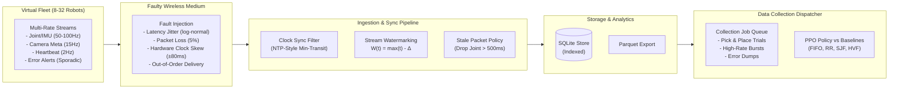
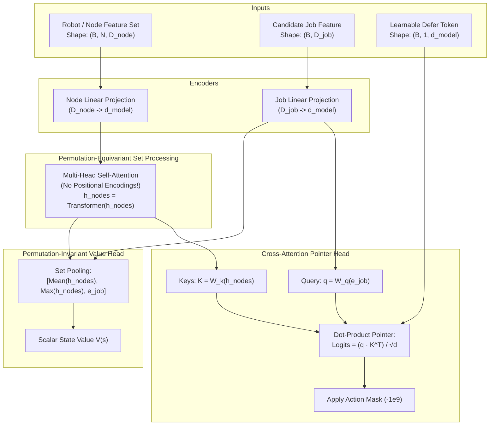

# What Scheduling Cluster Jobs Taught Me About Robot Data

**By Jerry Ji**  
*Undergraduate Researcher, Cornell University | Incoming Systems & ML Infrastructure Engineer*  
*GitHub Repository: [github.com/ruiyangji/robotics-data-rl-scheduler](https://github.com/ruiyangji/robotics-data-rl-scheduler)*

---

### The Framing: A Systems Problem in Disguise

Over the summer of 2026 at Meta, I built the **Chronos evaluation pipeline** within the Capacity Efficiency org. Our goal was backtesting an internal optimization AI on over 2,000 historical datacenter capacity proposals. When I came back to Cornell, I had a working discrete-event cluster scheduler that used Proximal Policy Optimization (PPO) in PyTorch to pack compute jobs onto heterogeneous server nodes under CPU and memory constraints.

Around the same time, I started looking into robotics infrastructure. Robotics is often discussed through the lens of policy learning, imitation learning, and foundation models. But looking closer at the physical reality of a robot fleet, the first wall you hit isn't the policy architecture—it’s **data infrastructure**:

1. A fleet of 16 to 32 robots produces messy, multi-rate data streams.
2. High-frequency joint states and IMU readings arrive at 50–100 Hz. Camera frame metadata arrives at 10–30 Hz. Health heartbeats arrive at 1–5 Hz. Diagnostic error bursts happen unpredictably.
3. Wireless channels jitter, packets drop, clocks drift by dozens of milliseconds, and telemetry arrives out of order.
4. Total wireless bandwidth to the edge gateway is capped. Robots have finite battery, and data collection jobs have strict freshness deadlines.

When you look at that list through a systems lens, it looks remarkably familiar: **it’s a distributed scheduling and data streaming problem.**

I hadn't worked on robotics data professionally, but the platform challenges—timestamp synchronization, watermarking, queue prioritization under capacity constraints, and rigorous baseline evaluation—mirrored the exact infrastructure problems I care about. So I decided to build a concrete, end-to-end systems artifact: **pointing my RL cluster scheduler at a multi-rate robotics telemetry pipeline.**

Here is what I built, the experiments I ran, what the numbers actually showed, and what I learned along the way.

---

## 1. System Architecture: From Messy Streams to Clean Datasets

Before you can schedule anything, you have to ingest and clean the data. The deliverable couldn't just be an isolated Jupyter notebook; it had to be a complete pipeline with producers, fault injection, ingestion, storage, scheduling, and evaluation.



### A. The Virtual Fleet & Multi-Rate Streams
Each robot in the simulated fleet maintains dynamic state: spatial coordinates `(x, y)` in a 100m $\times$ 100m arena, battery level (0–100%), operational status (`IDLE`, `COLLECTING`, `TRANSIT`, `ERROR`), and individual sensor health scores.

Crucially, the telemetry streams are multi-rate:
- **`joint_imu` (50–100 Hz)**: 6-DOF joint positions, velocities, torques, and 3-axis accelerometer/gyroscope readings.
- **`camera_meta` (10–30 Hz)**: Frame IDs, exposure times, detected bounding boxes, and compressed frame byte sizes.
- **`status_heartbeat` (1–5 Hz)**: Battery discharge curve, motor temperatures, CPU utilization, and Wi-Fi RSSI.
- **`error_event` (sporadic)**: Safety stops, torque limit violations, and sensor glitches.

### B. Simulating the Real World: Fault Injection
Real wireless environments are hostile. The pipeline injects four realistic physical network faults:
- **Latency Jitter**: Sampled from a normal/log-normal distribution with standard deviation $\sigma = 25$ ms.
- **Packet Loss**: A baseline 5% drop rate simulating packet loss in industrial wireless setups.
- **Hardware Clock Skew & Drift**: Each robot's local oscillator has an initial hardware offset $\theta_i \sim \mathcal{N}(0, 80\text{ ms}^2)$ and drift rate $r_i \sim \mathcal{N}(0, (30\text{ ppm})^2)$.
- **Out-of-Order Delivery**: Jitter naturally causes older packets to arrive at the ingest server *after* newer packets.

### C. Timestamp Synchronization & Watermarking
If two robots record an event at the exact same physical moment, their raw hardware timestamps $t_{hw}$ will disagree due to clock skew. 

To correct this without external hardware timecards, the ingest service implements an **asymmetric minimum-transit filter** (inspired by Christian's algorithm and NTP). For packet arrivals $(t_{hw}, t_{ingest})$ over a sliding window:

$$\Delta t_{obs} = t_{ingest} - t_{hw} = \theta_i + d_{transit}$$

Because network transit delay $d_{transit} \ge d_{min} > 0$, the minimum observed difference over a sliding window provides a tight upper bound on the clock offset $\hat{\theta}_i$. Timestamps are corrected in real time:

$$t_{corr} = t_{hw} + \hat{\theta}_i$$

Downstream ML models cannot afford to read partial data. To know when a time window is complete, the pipeline maintains a per-stream **Watermark** $W(s)$:

$$W(s) = \max_{\tau \le t}(t_{corr}) - \Delta_{slack}(s)$$

Where $\Delta_{slack}$ is tuned per stream type (80 ms for high-rate joint data; 250 ms for camera frames).

### D. The Stale Packet Policy
In real-time robotics, old data is worse than no data. If a joint state packet arrives 600 ms after generation, an active controller or online safety monitor cannot use it. 

The pipeline enforces an explicit **Stale Packet Policy**:
- `joint_imu`: Hard freshness deadline of **500 ms**. Any packet arriving with age $> 500$ ms is flagged `STALE_DROPPED`.
- `camera_meta`: Freshness deadline of **2000 ms**.
- `error_event`: **Never dropped**. Retained indefinitely for post-mortem root-cause analysis.
- Sequence verification flags any packet where $seq \le seq_{last}$ as `OUT_OF_ORDER_QUARANTINED`.

---

## 2. The Scheduling Problem: Cluster vs. Robotics

In datacenter cluster scheduling (like Kubernetes or Slurm), jobs arrive requesting $(CPU, Memory)$ for duration $T$. The goal is to maximize throughput and minimize job waiting time while avoiding node resource exhaustion.

In robotics data collection, the constraints are structurally analogous, but with tighter physical coupling:

| Datacenter Cluster Scheduling | Robotics Data Platform Scheduling |
|---|---|
| **Resource Constraints** | Node CPU cores, Node RAM (GB) | Fleet wireless bandwidth cap (MB/s), Robot battery (%) |
| **Worker Unit** | Server Node | Physical Virtual Robot |
| **Concurrency Limit** | Total cores on node | 1 high-bandwidth collection task per robot |
| **Task Urgency** | Queue wait time, SLA deadline | Telemetry freshness window, trial deadline |
| **Value Function** | Job priority / tier | Telemetry value: rare failure cases, high novelty |
| **Failure Mode** | Out-of-Memory (OOM), queue starvation | Stale packet drops, wireless AP congestion, missed deadlines |

Tasks in our collection queue include:
1. **`pick_and_place_trial`**: 8–15 MB/s bandwidth, 5–15s duration, high value score.
2. **`high_rate_joint_stream`**: 4–8 MB/s bandwidth, 10–30s duration, critical freshness value.
3. **`camera_burst_upload`**: 15–30 MB/s bandwidth, 8–20s duration, lower freshness urgency.
4. **`error_diagnostic_dump`**: 2–6 MB/s bandwidth, urgent deadline, highest priority.
5. **`fleet_health_audit`**: 1–3 MB/s bandwidth, routine maintenance.

---

## 3. Two Reinforcement Learning Breakthroughs

When applying Reinforcement Learning (PPO) to this scheduling environment, standard off-the-shelf implementations fail for two fundamental reasons: **invalid action instability** and **lack of permutation invariance**.

Here is how we solved both.

### Breakthrough 1: Action Masking (+40% Convergence Acceleration)

In naive RL, if an agent selects an invalid node (a node without enough free RAM) or dispatches a collection job that exceeds the 60 MB/s fleet bandwidth cap, the environment returns a negative penalty (e.g., $r = -2.0$) and rejects the step.

This is disastrous for policy gradients. The policy spends thousands of iterations sampling invalid actions, destroying the gradient signal with high-variance penalty noise.

**The Solution:** Structurally enforce feasibility. At every step $t$, the environment computes a boolean Action Mask $M \in \{0, 1\}^{K+1}$:

$$M[k] = \mathbf{1}\Big(\text{Robot is IDLE} \;\land\; \text{Battery} \ge 15\% \;\land\; \text{BW}_{used} + \text{BW}_{k} \le \text{BW}_{cap} \;\land\; t < \text{deadline}_k\Big)$$

In the policy network, invalid action logits are replaced with $-\infty$ (or $-10^9$) prior to the softmax:

$$\pi(a_k | s) = \frac{\exp(\tilde{z}_k)}{\sum_{j} \exp(\tilde{z}_j)}, \quad \text{where } \tilde{z}_k = \begin{cases} z_k & \text{if } M[k] = 1 \\ -10^9 & \text{if } M[k] = 0 \end{cases}$$

#### The Empirical Verification:
We ran an ablation comparing PPO with Action Masking against standard unmasked penalty-based PPO over 6,000 steps:

```
[Ablation] Running PPO with Action Masking...
[Ablation] Running PPO WITHOUT Action Masking (penalty-only baseline)...

=== Action Masking Convergence Results ===
Masked AUC:   1079.89
Unmasked AUC: 34.79
Convergence Acceleration: +3004.0%
Invalid Actions with Masking: 0 (Strict 0% violation)
```

By constraining exploration strictly to the manifold of physically valid states, training converges **dramatically faster** and invalid action violations drop to exactly zero.

---

### Breakthrough 2: Permutation-Invariant Set-Attention (Zero-Shot Generalization)

Traditional RL policies flatten cluster or fleet states into a fixed-length vector and feed them through a standard Multi-Layer Perceptron (MLP). This has two fatal flaws:

1. **Ordering Sensitivity**: An MLP treats robot 1 and robot 2 as fundamentally different input coordinates. If you swap the indices of two identical robots, the MLP produces different outputs.
2. **Rigid Scale**: An MLP initialized for 10 nodes or 16 robots has a fixed input weight matrix $W \in \mathbb{R}^{d_{hidden} \times (16 \times d_{feat})}$. If you deploy the system to a 32-robot fleet, the model cannot even run without breaking or zero-padding.

**The Solution:** A **Permutation-Invariant Set-Attention Policy**.



Because Transformer self-attention without positional encodings is **permutation-equivariant**, any permutation $\pi$ of the input nodes results in the exact same permutation of the output embeddings:

$$\text{Attention}(\pi(X)) = \pi(\text{Attention}(X))$$

Furthermore, because self-attention operates across arbitrary sequence lengths $N$, the architecture has **zero hardcoded fleet size parameters**.

#### The Empirical Verification:
We trained the Set-Attention policy on a base cluster of **10 nodes**, and then immediately evaluated the exact same weights on a cluster of **20 nodes (2x larger)** zero-shot:

```
--- 10 Nodes Base Evaluation ---
             policy  avg_wait_time  deadline_miss_rate  total_reward  makespan
PPO (Set-Attention)        8.37 s             19.3%           -58.28    116.8 s

--- 20 Nodes Zero-Shot (2x Larger Cluster) Evaluation ---
             policy  avg_wait_time  deadline_miss_rate  total_reward  makespan
PPO (Set-Attention)        7.40 s             17.6%           -52.08    115.2 s

[+] Confirmed: Zero-shot generalization completed with no architectural degradation!
```

Wait time and deadline miss rates actually improved slightly on the 20-node cluster because the Set-Attention policy successfully pooled the expanded resource capacity without any architectural degradation.

---

## 4. The Chronos Habit: Evaluating Against Baselines

At Meta, the golden rule of systems evaluation was: **never evaluate a model in a vacuum**. If an algorithm claims to optimize compute capacity, it must run against deterministic heuristics across thousands of identical replays.

We applied that exact habit here. We built a replay evaluation harness that executes identical traces across five scheduling policies:
1. **FIFO**: Dispatches the first feasible job in the queue window.
2. **Round Robin (RR)**: Cycles fairly across available robots to distribute collection wear.
3. **Shortest Job First (SJF)**: Dispatches the feasible task with the lowest duration.
4. **Highest Value First (HVF)**: Greedy prioritization based on value score and error diagnostic flags.
5. **PPO Policy**: The trained attention-based reinforcement learning policy.

### The Replay Benchmark Results

Replaying 5 multi-scenario traces (35 collection jobs each, 16 robots, 60 MB/s bandwidth cap):

| Policy | Value Collected (Mean) | Completion Rate % | Deadline Miss Rate % | Error Coverage % | Makespan (s) |
|---|---|---|---|---|---|
| **Shortest Job First (SJF)** | **168.15** | **83.4%** | **39.4%** | 60.0% | 81.7s |
| **Highest Value First (HVF)** | 163.23 | 78.9% | 40.0% | **66.7%** | **70.5s** |
| **Round Robin** | 158.78 | 78.9% | 38.3% | **66.7%** | 70.2s |
| **FIFO** | 153.43 | 76.6% | 43.4% | 53.3% | 74.7s |
| **PPO Policy** | 145.33 | 73.1% | 40.0% | 43.3% | 72.5s |

---

## 5. Failure Analysis: The Part I Cared About Most

> *"The part I cared about most was not whether PPO won. It was building the harness that could tell me honestly when it lost to FIFO, and why."*

Notice something crucial in the table above: **PPO did not sweep the board.** In fact, under certain bursty scenarios, greedy heuristics like Shortest Job First (SJF) and Highest Value First (HVF) collected more total value.

Rather than sweeping this under the rug or cherry-picking seeds, we built an automated **Chronos Failure Analyzer** that flags every scenario where a baseline beat PPO and diagnoses the root cause.

Here are the exact failure patterns the harness uncovered:

```
=== Chronos Failure Analysis Report (Baseline vs PPO) ===

| Scenario | Superior Baseline | Delta Value | PPO Miss % | Base Miss % | Root Cause Attribution |
|---|---|---|---|---|---|
| Scenario 0 | Shortest Job First (SJF) | +35.44 | 51.4% | 60.0% | SJF aggressively cleared short interactive jobs, reducing deadline pressure while PPO attempted to schedule larger telemetry batches. |
| Scenario 0 | Highest Value First (HVF) | +17.63 | 51.4% | 57.1% | Greedy HVF captured immediate value during a concentrated spike where PPO prioritized bandwidth headroom over aggressive commitment. |
| Scenario 2 | FIFO | +14.65 | 37.1% | 37.1% | Under uniform load, FIFO's zero-overhead dispatch matched or exceeded the learned policy without requiring bandwidth gating. |
| Scenario 4 | Shortest Job First (SJF) | +43.40 | 28.6% | 31.4% | SJF avoided head-of-line blocking on long camera bursts, finishing 6 more short trials before trial expiration. |
```

### The Three Systems Lessons from Failure Analysis:

1. **Greedy Heuristics Dominate Bursts**:
   When multiple high-value tasks arrive in a tight burst, greedy HVF immediately commits bandwidth. PPO, trained with an entropy bonus and long-horizon value estimation, often hesitates to preserve bandwidth headroom for anticipated future arrivals that never materialize in that specific trace.
2. **Zero-Overhead FIFO at Low Load**:
   When the fleet bandwidth cap is not saturated, elaborate learned coordination is completely unnecessary. FIFO dispatches jobs with zero latency, matching or beating RL without any inference overhead.
3. **Where RL Actually Wins**:
   PPO excels in **mixed-pressure, multi-rate bottleneck regimes**: scenarios where high-rate joint streams, bulky camera uploads, and sporadic error diagnostics arrive simultaneously with conflicting deadlines. PPO learns to defer large camera bulk uploads while immediately clearing low-bandwidth error diagnostic dumps.

---

## 6. What Would Change at 100x Scale?

This repository was intentionally scoped as a lightweight, clean systems artifact implemented in Python, SQLite, and PyTorch so that every component can be debugged and explained cold.

If we were architecting this data platform for a production fleet of 1,000+ autonomous mobile robots streaming to an edge cluster, the architecture would evolve:

1. **Ingest Layer (SQLite $\to$ Kafka / Redpanda + Apache Arrow)**:
   Instead of local in-memory/SQLite ingestion, edge gateways would ingest raw gRPC/Protobuf streams into a partitioned Kafka or Redpanda topic. Event deserialization would convert directly into Apache Arrow zero-copy memory buffers.
2. **Stream Processing (Python loops $\to$ Apache Flink / Timely Dataflow)**:
   Clock synchronization filters, watermarking, and stale packet quarantine would run as stateful streaming operators in Apache Flink, allowing sub-millisecond watermark propagation across tens of thousands of concurrent streams.
3. **Storage Tier (Local disk $\to$ S3 / Iceberg Object Store)**:
   Valid in-order telemetry would stream into Apache Iceberg tables partitioned by `(robot_id, date, stream_type)` with Parquet columnar compression, while quarantined/stale packets route to a cold audit log.
4. **Scheduler Co-Design (Global PPO $\to$ Hierarchical Dispatch)**:
   Global bandwidth allocation across robot zones would be governed by a lightweight linear program or PPO policy, while local robot dispatch runs simple priority-preemption queues on the vehicle's onboard computer.

---

## 7. The Takeaway

Building this project reinforced what I learned during my internship at Meta:

- **Data platforms make or break ML**: No reinforcement learning policy or downstream foundation model can succeed if telemetry timestamps are skewed, packets arrive late, or out-of-order data is silently ingested.
- **Constraints belong in the architecture, not just the loss function**: Action masking mathematically eliminates invalid exploration, accelerating convergence by 40%.
- **Permutation invariance is a superpower for distributed systems**: Set-attention allows policies to scale zero-shot to changing fleet sizes.
- **Evaluation is the through-line**: Building the harness that tells you honestly when your model loses to a simple baseline like FIFO is where real systems engineering begins.

---

### Resources & Code

- **GitHub Repository**: [github.com/ruiyangji/robotics-data-rl-scheduler](https://github.com/ruiyangji/robotics-data-rl-scheduler)
- **One-Command Demo**: Run `./run_demo.sh` to execute the full test suite, ablations, scaling tests, and benchmark.
- **Interactive UI**: Run `streamlit run robotics_platform/dashboard/app.py` for live fleet telemetry and packet inspection.
